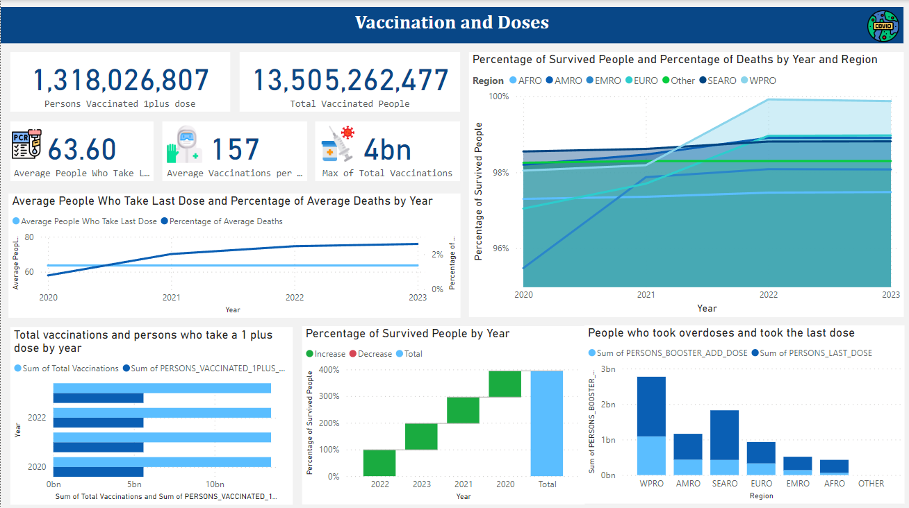

# Table of Contents
1.**Introduction**
1.**Overview Dashboard**
3.**Dataset**
4.**EXCEL**
5.**Model view**
6.**Usage**

# Intoduction
The project aims to analyze the 'COVIDE-19' dataset to derive insights and facilitate data-driven decision-making for anyone interested in data analysis and dashboards.

# Overview Dashboard

**Process of the project**

I analyze the data using Power BI to extract valuable information from the data recorded by the 'Ministry of World Health' which contains a lot of data such as the number of vaccines, the number of new and old vaccinations, the number of cases, and other data that I used to extract insights that benefits the stakeholders and makes them see the data in a more detailed way with accuracy.
The business question here is "What is the impact of COVID-19 vaccinations on the number of cases, deaths, and survivors, and how does the dosage administration relate to the mortality rate?"

# Dataset

The dataset consists of three sheets, one of which is a fact table, and the others are dimensions of it. The fact table contains the following columns:

Country

ISO3: refers to the three-letter country codes defined by the International Organization for Standardization (ISO). These codes are part of the ISO 3166 standard, which establishes codes for the names of countries, dependent territories, and special areas of geographical interest

Region

DATA_SOURCE

Total Vaccinations

PERSONS_VACCINATED_1PLUS_DOSE

TOTAL_VACCINATIONS_PER100

PERSONS_VACCINATED_1PLUS_DOSE_PER100

PERSONS_LAST_DOSE

PERSONS_LAST_DOSE_PER100

FIRST_VACCINE_DATE

NUMBER_VACCINES_TYPES_USED

... (and other attributes related to COVIDE-19)

# EXCEL
**Data Processing and cleaning with Excel**
1. Load the dataset into EXCEL
2. Handle missing values.
3. Remove duplicates.
4. Convert data types.
5. Address outliers or anomalies.
6. replace values

# Model View of the datasets

In my data model, I have implemented a star schema comprising two dimension tables and one fact table to enhance the organization and analysis of my COVID-19 vaccination data. The fact table, named 'FactVaccinationData,' serves as the central repository for key quantitative measures related to vaccinations. Additionally, I have integrated two dimension tables, namely 'DimWho_COVID_19_Global_Data' and 'DimVaccine_Metadata,' to provide detailed contextual information.

Fact Table: FactVaccinationData

The central repository for quantitative data related to COVID-19 vaccinations.
Key columns include measures such as the number of vaccinations, vaccination dates, and other relevant metrics.
Foreign keys establish relationships with the primary keys of associated dimension tables.
Dimension Tables:
a. DimWho_COVID_19_Global_Data

Contains descriptive information related to global COVID-19 data, such as country details, population statistics, and geographical attributes.
Primary key: [country].
Foreign key in FactVaccinationData links to the primary key in this dimension.
b. DimVaccineMetadata

Provides metadata about the vaccines used in the vaccination process, including vaccine names, manufacturers, and other relevant details.
Primary key: [ISO3].
Foreign key in FactVaccinationData establishes a relationship with the primary key in this dimension.
Relationships:

I have carefully established relationships between FactVaccinationData and each dimension table using foreign keys.
These relationships enable seamless querying and analysis across dimensions, allowing for a holistic exploration of the COVID-19 vaccination data.
By implementing this star schema, I aim to optimize data retrieval and analysis, providing a solid foundation for generating valuable insights into the global COVID-19 vaccination landscape. The structured relationships between the fact and dimension tables enhance the efficiency and clarity of data exploration within the model

# Usage
you can access the Power BI dashboard and the dataset by download the file I mentioned above
